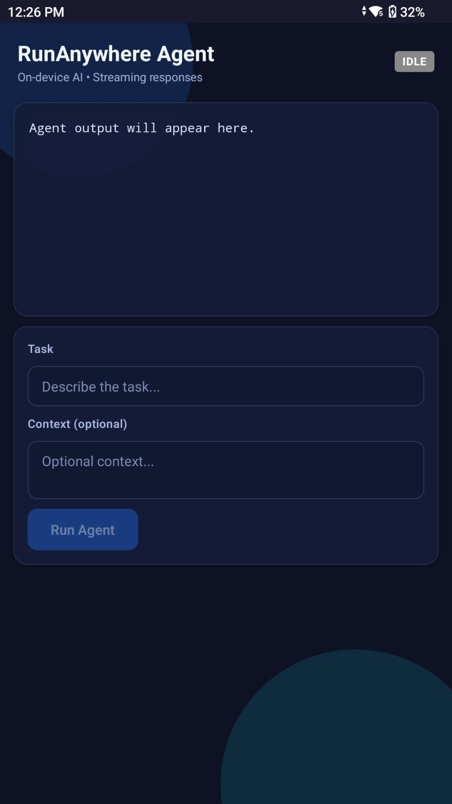
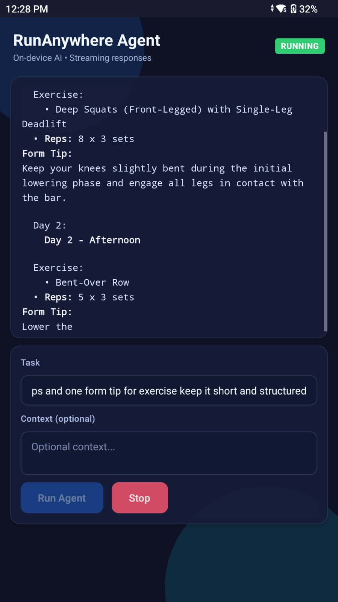
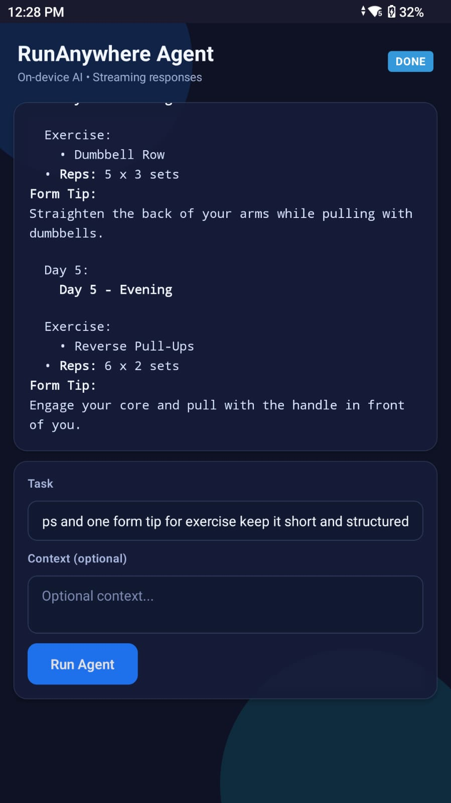

# RunAnywhere Agent Demo (React Native + Kotlin)

This is a React Native demo app that uses the **RunAnywhere Kotlin SDK** on Android via a native Kotlin bridge. It demonstrates on-device LLM generation with streaming tokens.

## Stack

- **UI:** React Native (TypeScript)
- **Native:** Kotlin (React Native Module)
- **SDK:** RunAnywhere Kotlin SDK (LlamaCPP backend)
- **Device:** ARM64 Android device (AYN Thor recommended)

## Model (default)

```
qwen2.5-0.5b-instruct-q6_k
```

Model is registered in `android/app/src/main/java/com/runanywhereagentdemo/MainApplication.kt` and used in `src/state/useAgentRunner.ts`.

## Prerequisites

- Node.js + npm
- Android Studio + SDK + platform-tools
- Java 17+ (Android Studio bundled JBR is fine)
- A physical ARM64 Android device (x86 emulators are not supported for native libs)

## Setup

1. Start Metro

```sh
npm start
```

2. Build & install on device

```sh
npx react-native run-android --device <your-device-id>
```

Example device id:

```sh
adb devices
```

## RunAnywhere SDK Notes

The SDK is built locally and published to Maven Local.

If you change SDK code or clean caches, republish:

```sh
cd G:\Code\runanywhere-sdks\sdk\runanywhere-kotlin
.\gradlew --% -Prunanywhere.testLocal=false -Prunanywhere.nativeLibVersion=0.17.4 publishToMavenLocal
```

## Troubleshooting

- **App crashes on emulator**: RunAnywhere JNI libs are ARM64. Use a real device.
- **Gradle plugin error with Java 25**: Use Android Studio JBR (Java 17/21).
- **Model download is slow**: First run downloads ~500MB+ model.
- **Poor answers**: Switch to larger model in `MainApplication.kt` and `useAgentRunner.ts`.

## Demo Checklist

- Open app on device
- Enter a task (e.g., "How do I cook pasta?")
- Observe streaming output
- Tap Stop to cancel generation

## Agent Demo (Android Action Kernel style)

This repo includes a **Python-based Android agent** (ADB + accessibility tree) in `agent/`.  
It can control native apps on a connected Android device.

### Prerequisites
- Python 3.10+
- ADB installed
- Android device with USB debugging enabled

### Run the agent

```sh
cd agent
python -m venv .venv
.\.venv\Scripts\activate
pip install -r requirements.txt
copy .env.example .env
```

Edit `.env` and set:
- `OPENAI_API_KEY` (or switch `LLM_PROVIDER` + keys)
- `DEVICE_ID` (from `adb devices`)

Then run:

```sh
python kernel.py
```

Example goal:
```
Open the Settings app and turn on Wi‑Fi
```

## Demo Screenshots

Idle  


Running  


Done  


---

Built for the RunAnywhere Agent demo.
